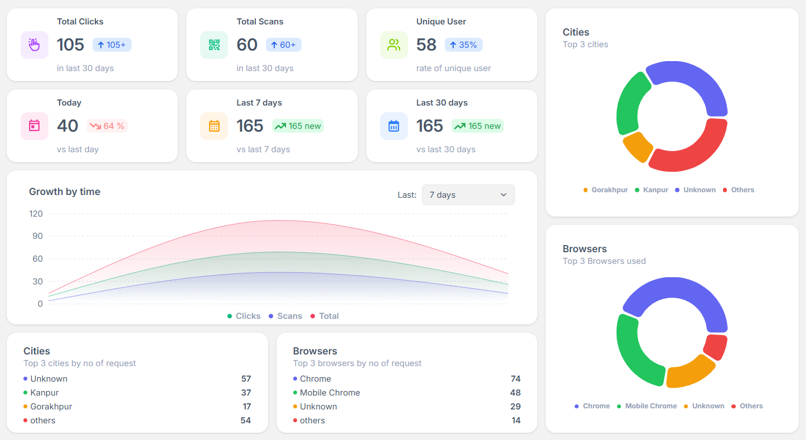
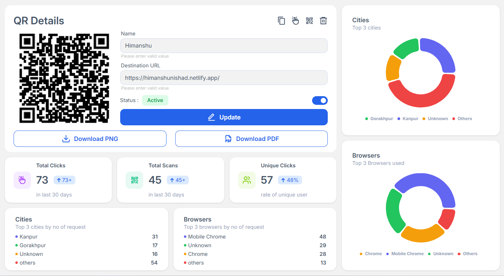

# CropURL 🔗

CropURL is a full-stack URL shortener and QR code analytics platform that helps users create, manage, and track short links and QR codes.
It provides detailed analytics including clicks, scans, unique visitors, locations, browsers, operating systems, and daily engagement.
Built with React.js, Node.js, Express.js, MongoDB, and Redux Toolkit, CropURL combines a responsive dashboard with secure authentication and REST APIs.
The project focuses on turning simple links into measurable, data-driven marketing and sharing tools.

CropURL allows users to create short URLs, generate QR codes, and track clicks, scans, unique visitors, locations, browsers, operating systems, and daily engagement through an analytics dashboard.

## 🚀 Live Demo

**Live:** https://cropurl.in

**Frontend Repository:** https://github.com/himanshunishad620/cropurl_client

**Backend Repository 1:** https://github.com/himanshunishad620/cropurl_admin_backend

**Backend Repository 2:** https://github.com/himanshunishad620/cropurl_user_backend

---

## ✨ Features

- 🔗 Create and manage shortened URLs
- 📱 Generate QR codes for short links
- 📊 Track clicks and QR scans
- 👥 Track unique visitors/clicks
- 📈 View 7, 30, and 90-day analytics
- 🌍 Track visitor locations by city
- 🌐 Browser and location analytics
- 🔍 Search, filter, and sort URLs
- 📥 Import URLs using CSV
- 📤 Export URL data to CSV
- 🌐 Custom domain integration
- 🔐 JWT-based authentication
- ✉️ Email verification and password reset
- 📱 Responsive dashboard
- 🔔 Loading, validation, empty, and error states

---

## 🛠️ Tech Stack

### Frontend

**React 19 · Vite · Tailwind CSS · Redux Toolkit · RTK Query · React Router · Axios · Recharts · PapaParse**

### Backend

**Node.js · Express.js · MongoDB · Mongoose · JWT · bcrypt · Resend · UAParser**

### Services & Deployment

**MongoDB Atlas · Vercel · Custom Domain**

---

## 📸 Screenshots

### Dashboard



### URL Management & Analytics



### QR Creation


---

## 🧩 Key Technical Highlights

- Built a SPA using **React and Tailwind CSS**
- Used **Redux Toolkit and RTK Query** for state and server-state management
- Designed REST APIs using **Node.js and Express.js**
- Designed URL and analytics schemas using **MongoDB and Mongoose**
- Implemented **JWT authentication** and protected routes
- Implemented email verification and password-reset workflows
- Integrated **Resend** for transactional emails
- Implemented **custom domain integration** for the production website
- Configured custom domain-based links for **email verification and password reset**
- Configured **DNS and HTTPS** for the custom domain
- Built click and QR scan tracking with daily analytics
- Added city, browser, and OS-based analytics
- Built interactive analytics charts using **Recharts**
- Implemented CSV validation, bulk import, and export
- Configured production deployment with environment-based configuration

---

## 🔄 How It Works

```text
Long URL
   ↓
Generate Short Code
   ↓
Short URL / QR Code
   ↓
User Opens or Scans
   ↓
Track Analytics
   ↓
Redirect to Destination
```

---

## ⚙️ Getting Started

### Prerequisites

- Node.js 20+
- npm
- MongoDB / MongoDB Atlas

### Clone the Repository

```bash
git clone https://github.com/himanshunishad620/cropurl_client.git
```

### Frontend

```bash
cd frontend
npm install
npm run dev
```

Create a `.env` file:

```env
VITE_BASE_URL=<your_backend_url>
VITE_CLICK_URL=<your_click_scan_backend_url>
VITE_SERVICE_KEY=<your_emailjs_service_id>
VITE_TEMPLATE_KEY=<your_emailjs_template_id>
VITE_PUBLIC_KEY=<your_emailjs_public_key>
```

---

## 🔐 Security

- Password hashing with bcrypt
- JWT-based authentication
- Protected API routes
- HTTP-only and secure cookies where applicable
- CORS configuration
- Environment variables for secrets
- Input and URL validation
- Expiring verification and password-reset tokens

**Never commit `.env` files or secrets to GitHub.**

---

## ⚠️ Backend Dependencies

This frontend requires two separate backend services to be configured and running:

1. **Admin & User Backend** – Handles authentication, user management, URL/QR management, and core application APIs.  
   **Repository:** https://github.com/himanshunishad620/cropurl_admin_backend.git

2. **Click & Scan Management Backend** – Handles short URL clicks, QR scans, visitor tracking, and analytics data.  
   **Repository:** https://github.com/himanshunishad620/cropurl_user_backend.git

## 👨‍💻 Author

**Himanshu Nishad**

BCA Graduate · Frontend / Full-Stack Developer

Focused on building modern web applications using **React, JavaScript, Node.js, and MongoDB**.

---

⭐ If you found CropURL interesting, consider starring the repository.
